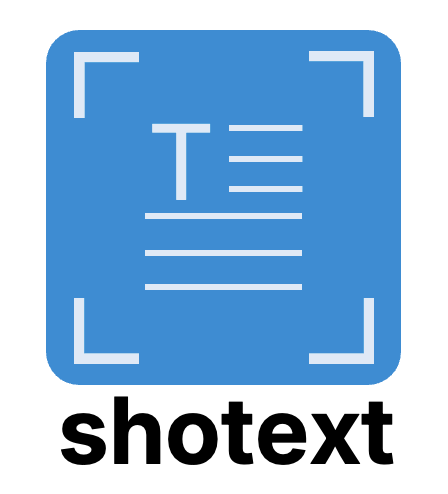
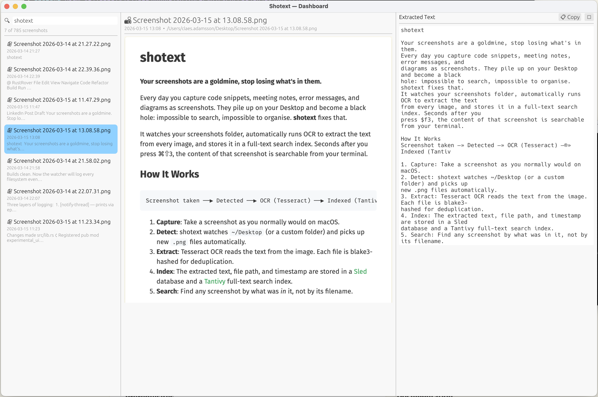

<div align="center">
  <p align="center">
    
  </p>

[](https://crates.io/crates/shotext)
[](https://crates.io/crates/shotext)

</div>

**Your screenshots are a goldmine, stop losing what's in them.**

Every day you capture code snippets, meeting notes, error messages, and diagrams as screenshots. They pile up on your
Desktop and become a black hole: impossible to search, impossible to organise. **shotext** fixes that.

It watches your screenshots folder, automatically runs OCR to extract the text from every image, and stores it in a
full-text search index. Seconds after you press ⌘⇧3, the content of that screenshot is searchable from your terminal.

## How It Works

```
Screenshot taken ──▶ Detected ──▶ OCR (Tesseract) ──▶ Indexed (Tantivy) ──▶ Searchable
```

1. **Capture**: Take a screenshot as you normally would on macOS.
2. **Detect**: shotext watches `~/Desktop` (or a custom folder) and picks up new `.png` files automatically.
3. **Extract**: Tesseract OCR reads the text from the image. Each file is blake3-hashed for deduplication.
4. **Index**: The extracted text, file path, and timestamp are stored in a [Sled](https://github.com/spacejam/sled)
   database and a [Tantivy](https://github.com/quickwit-oss/tantivy) full-text search index.
5. **Search**: Find any screenshot by what was _in_ it, not by its filename.

## Installation

### Prerequisites

- **Rust** toolchain (`cargo`)
- **Tesseract** OCR engine and language data

```bash
# Install Tesseract via Homebrew
brew install tesseract

# Clone and build
git clone https://github.com/cladam/shotext.git
cd shotext
cargo build --release

# The binary is at target/release/shotext
```

#### Installing from crates.io

The easiest way to install `shotext` is to download it from [crates.io](https://crates.io/crates/shotext). You can do it
using the following command:

```bash
cargo install shotext
```

If you want to update `shotext` to the latest version, execute the following command:

```bash
shotext update
```

## Quick Start

```bash
# 1. Initialise config (creates ~/.config/shotext/config.toml)
shotext config

# 2. Index all existing screenshots on your Desktop
shotext ingest

# 3. Start watching for new screenshots in real-time
shotext watch

# 4. Search, what was in that error message?
shotext search "connection refused"

# 5. Or launch the interactive fuzzy finder
shotext search

# 6. Tag a screenshot for easy filtering
shotext tag <hash-or-path> --add work --add important

# 7. Open the experimental GUI dashboard
shotext x
```

## Commands

| Command                  | Description                                                                                                     |
|--------------------------|-----------------------------------------------------------------------------------------------------------------|
| `shotext ingest`         | Scan the screenshots folder and index all new images. Use `-f` to force re-index everything.                    |
| `shotext watch`          | Watch the folder for new screenshots and index them the moment they appear.                                     |
| `shotext search <query>` | Full-text search across all extracted text. Supports stemming ("develop" → "developer", "developing").          |
| `shotext search`         | Interactive fuzzy finder (powered by [skim](https://github.com/lotabout/skim)) over all indexed screenshots.    |
| `shotext list`           | List all indexed screenshots. Add `-v` for dates and text snippets.                                             |
| `shotext view <target>`  | Open a screenshot in a native GUI viewer with extracted text, tagging, and delete. Accepts a file path or hash. |
| `shotext tag <target>`   | Add, remove, or list tags on a screenshot. Tags are persisted and searchable.                                   |
| `shotext x`              | Launch the experimental Insights dashboard — a full GUI for browsing, searching, and viewing screenshots.       |
| `shotext config`         | Show the current configuration. Use `-e` to open it in your `$EDITOR`.                                          |

## Tagging

Screenshots can be tagged for easy organisation and filtering. Tags are persisted in the database and indexed in
Tantivy, so they show up in search results.

```bash
# Add tags (accepts a file path or a blake3 hash)
shotext tag ~/Desktop/Screenshot\ 2025-04-23.png --add work --add meeting

# Remove a tag
shotext tag <hash> --remove meeting

# List current tags
shotext tag <hash>
```

Tags are also available in both the `view` and `x` GUIs — you can add and remove them directly from the interface.

## Experimental: Insights Dashboard (`shotext x`)

The `x` command launches a native desktop GUI that brings together browsing, searching, and viewing in a single window.



### Features

- **Live search** — type in the search bar and results filter in real-time using Tantivy full-text search, with a
  substring fallback
- **Keyboard shortcuts** — `⌘F` to focus search, `↑`/`↓` arrows to navigate the list
- **Tagging** — add and remove tags directly from the text panel; tags are persisted and searchable
- **Delete** — permanently remove a screenshot from the index, database, and disk (with confirmation)
- **Lazy image loading** — only the selected screenshot is loaded into memory
- **Collapsible text drawer** — the OCR text panel slides out from the right and can be closed/reopened
- **Virtualised scroll** — the sidebar only renders visible rows, keeping things smooth even with thousands of
  screenshots

> **Note:** This is an experimental feature. The command name `x` signals that the interface may change between
> releases.

## Configuration

Config lives at `~/.config/shotext/config.toml` and is created automatically on first run:

```toml
[paths]
screenshots = "/Users/you/Desktop"   # Folder to watch / ingest
database = "/Users/you/Library/Application Support/shotext/index.db"

[ocr]
language = "eng"   # Tesseract language code (eng, swe, deu, …)
```

## Tech Stack

| Component  | Crate                                              | Role                                   |
|------------|----------------------------------------------------|----------------------------------------|
| CLI        | [clap](https://github.com/clap-rs/clap)            | Command parsing with derive macros     |
| OCR        | [tesseract](https://crates.io/crates/tesseract)    | Text extraction via libtesseract       |
| Hashing    | [blake3](https://github.com/BLAKE3-team/BLAKE3)    | Fast deduplication of screenshot files |
| Database   | [sled](https://github.com/spacejam/sled)           | Embedded key-value store for metadata  |
| Search     | [tantivy](https://github.com/quickwit-oss/tantivy) | Full-text search index with stemming   |
| Watcher    | [notify](https://github.com/notify-rs/notify)      | Filesystem polling for new screenshots |
| Fuzzy find | [skim](https://github.com/lotabout/skim)           | Interactive terminal search UI         |
| Viewer     | [eframe/egui](https://github.com/emilk/egui)       | Native GUI window for image + text     |

## License

[MIT](LICENSE)
